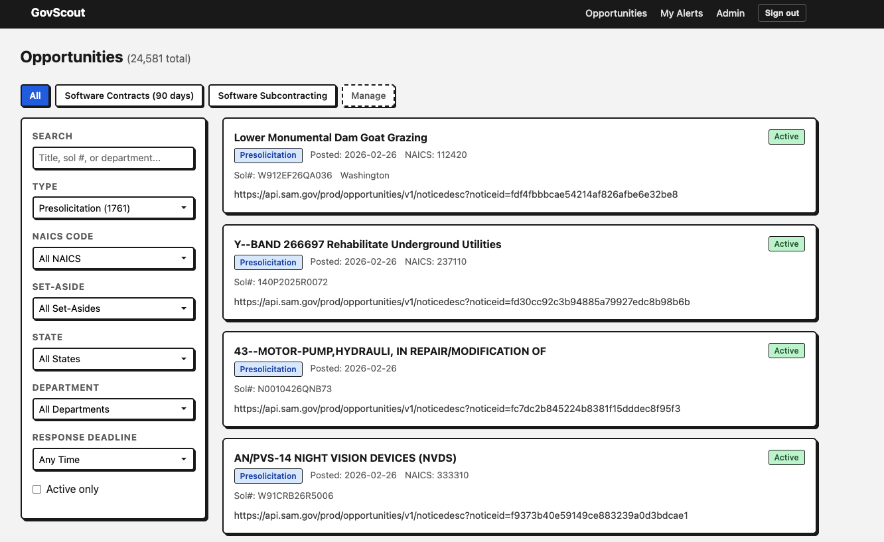

# GovScout

[](LICENSE)

Web application to search, filter, and track federal contract opportunities from the [SAM.gov](https://sam.gov) Opportunities API. Single Go binary with multi-user auth, saved search alerts, and automatic daily sync.



## Features

- Browse and search opportunities by keyword, NAICS code, type, state, set-aside, and department
- Live filtering with HTMX (no full page reloads)
- Detailed opportunity views with contacts, awards, and place of performance
- Saved search alerts with keyword matching (include/exclude, match all/any)
- Webhook delivery for alert notifications
- Two-phase sync: incremental (last 3 days) + historical backfill (90-day windows)
- Multi-user auth with admin role (user management, manual sync trigger)
- API key rotation for SAM.gov rate limit resilience

## Prerequisites

- [Go](https://go.dev/dl/) 1.23+
- A free SAM.gov API key ([register here](https://sam.gov/content/home))

## Quick Start

1. Clone the repository:

    ```bash
    git clone https://github.com/theognis1002/govscout.git
    cd govscout
    ```

2. Configure environment:

    ```bash
    cp .env.example .env
    # Edit .env and add your SAM.gov API key + auth secret
    ```

3. Create an admin user and start the server:

    ```bash
    go run ./cmd/govscout useradd --username admin --password secret --admin
    go run ./cmd/govscout serve
    ```

4. Open http://localhost:8080 and log in.

## Usage

```bash
# Start web server (default :8080, rebuilds on each run)
go run ./cmd/govscout serve --dev

# Run daily sync (incremental + backfill)
go run ./cmd/govscout sync

# Preview what sync would fetch without writing
go run ./cmd/govscout sync --dry-run

# Limit API calls for a single sync run
go run ./cmd/govscout sync --max-calls 5

# Backfill toward a specific date
go run ./cmd/govscout sync --from 01/01/2020

# Create a user
go run ./cmd/govscout useradd --username alice --password changeme

# Create an admin user
go run ./cmd/govscout useradd --username admin --password secret --admin

# Send a test email via Resend (uses TEST_EMAIL_TO or --to)
go run ./cmd/govscout testemail
go run ./cmd/govscout testemail --to someone@example.com

# Migrate data from old (Rust) DB
go run ./cmd/govscout migrate --old ./govscout.db.old
```

## Architecture

```
cmd/govscout/main.go              # CLI: serve | sync | useradd | passwd
internal/
├── db/
│   ├── db.go                     # Open, pragmas (WAL), migrate
│   ├── migrations/001_initial.sql # Full schema (go:embed)
│   ├── opportunities.go          # QueryBuilder, upsert, list, detail, stats
│   ├── users.go                  # User CRUD
│   ├── searches.go               # SavedSearch CRUD
│   ├── filters.go                # SavedFilter CRUD + seed defaults
│   ├── alerts.go                 # Alert insert (dedupe), delivery tracking
│   └── sync.go                   # sync_runs + backfill cursor
├── samgov/
│   ├── client.go                 # HTTP client, API key rotation, SearchWindow
│   └── types.go                  # SAM.gov API response structs
├── sync/
│   └── sync.go                   # Two-phase: incremental + backfill
├── alerts/
│   ├── matcher.go                # Keyword matching + webhook delivery
│   └── email.go                  # Resend email delivery
└── web/
    ├── server.go                 # Chi router, middleware stack
    ├── handlers.go               # All HTTP handlers
    ├── templates.go              # go:embed template loading + funcMap
    ├── auth.go                   # securecookie sessions, auth middleware
    ├── labels.go                 # NAICS, type, set-aside label maps
    ├── static/style.css          # Minimal CSS (embedded)
    └── templates/                # HTML templates (embedded)
```

## Configuration

| Variable            | Required         | Description                                                 |
| ------------------- | ---------------- | ----------------------------------------------------------- |
| `SAMGOV_API_KEY`    | Yes (for sync)   | SAM.gov API key. Supports comma-separated keys for rotation |
| `AUTH_SECRET`       | Yes (production) | Session cookie signing secret, 32+ random chars             |
| `GOVSCOUT_DB`       | No               | SQLite database path (default: `./govscout.db`)             |
| `PORT`              | No               | Web server port (default: `8080`)                           |
| `RESEND_API_KEY`    | No               | Resend API key for email alert delivery                     |
| `RESEND_FROM_EMAIL` | No               | Sender address for alert emails (default: `GovScout <alerts@resend.dev>`) |
| `TEST_EMAIL_TO`     | No               | Recipient for `govscout testemail`                          |
| `ALERT_WEBHOOK_URL` | No               | Default webhook URL for alert delivery                      |

See [.env.example](.env.example) for the template.

## Routes

**Public:** `GET /login`, `POST /login`, `POST /logout`, `GET /static/*`, `GET /health`

**Auth required:**

- `GET /opportunities` — full page with sidebar filters + HTMX
- `GET /opportunities/partial` — HTMX partial (results fragment)
- `GET /opportunities/{id}` — detail view
- `GET /alerts` — saved search list + recent alerts
- `GET /alerts/new`, `POST /alerts` — create saved search
- `GET /alerts/{id}`, `POST /alerts/{id}` — view/update saved search
- `POST /alerts/{id}/toggle` — enable/disable
- `GET /alerts/{id}/preview` — preview matching opportunities

**Admin:**

- `POST /admin/sync` — trigger sync in background
- `GET /admin/sync-runs` — sync history
- `GET /admin/users`, `POST /admin/users`, `POST /admin/users/{id}/delete` — user management

## Sync

The `sync` command is designed for daily cron/timer use:

- **Incremental**: fetches last 3 days of opportunities (~1 API call)
- **Backfill**: uses remaining budget for historical data in 90-day windows
- **Rate limit safe**: stops gracefully on 429, saves cursor, resumes next run
- **Alert matching**: runs after sync to find new matches for saved searches

## Deployment

### Build for Production

```bash
go build -o govscout ./cmd/govscout
```

Copy the `govscout` binary and `.env` to your server. No other files needed — templates, CSS, and migrations are embedded in the binary.

### Systemd

```bash
# Copy service files
sudo cp systemd/govscout.service /etc/systemd/system/
sudo cp systemd/govscout-sync.service /etc/systemd/system/
sudo cp systemd/govscout-sync.timer /etc/systemd/system/

# Enable and start
sudo systemctl enable --now govscout
sudo systemctl enable --now govscout-sync.timer
```

- `govscout.service` — web server (long-running)
- `govscout-sync.service` — one-shot sync
- `govscout-sync.timer` — daily at 2am, Persistent=true

## Development

```bash
go run ./cmd/govscout serve   # Run with auto-rebuild
go build ./cmd/govscout       # Build standalone binary
gofmt -w .                    # Format
go vet ./...                  # Lint
go test ./...                 # Test
```

## Reference Tables

### Software-Related NAICS Codes

| Code       | Description                                    |
| ---------- | ---------------------------------------------- |
| **541511** | Custom Computer Programming Services           |
| **541512** | Computer Systems Design Services               |
| **541513** | Computer Facilities Management Services        |
| **541519** | Other Computer Related Services                |
| **518210** | Data Processing, Hosting, and Related Services |
| **511210** | Software Publishers                            |

### Opportunity Types

| Code | Type                           | Description                                            |
| ---- | ------------------------------ | ------------------------------------------------------ |
| `o`  | Solicitation                   | Active solicitation accepting bids/proposals           |
| `p`  | Presolicitation                | Notice of upcoming solicitation                        |
| `k`  | Combined Synopsis/Solicitation | Combined notice (common for simplified acquisitions)   |
| `r`  | Sources Sought                 | Market research; agency seeking capability statements  |
| `s`  | Special Notice                 | Informational (conferences, training, events)          |
| `a`  | Award Notice                   | Contract has been awarded                              |
| `u`  | J&A                            | Justification for other-than-full-and-open competition |
| `g`  | Intent to Bundle               | Notice of intent to bundle requirements                |
| `i`  | Fair Opportunity               | Justification for limiting competition                 |

### Set-Aside Codes

| Code       | Description                                               |
| ---------- | --------------------------------------------------------- |
| `SBA`      | Total Small Business Set-Aside                            |
| `SBP`      | Partial Small Business Set-Aside                          |
| `8A`       | 8(a) Set-Aside                                            |
| `8AN`      | 8(a) Sole Source                                          |
| `HZC`      | HUBZone Set-Aside                                         |
| `HZS`      | HUBZone Sole Source                                       |
| `SDVOSBC`  | Service-Disabled Veteran-Owned Small Business Set-Aside   |
| `SDVOSBS`  | Service-Disabled Veteran-Owned Small Business Sole Source |
| `WOSB`     | Women-Owned Small Business Set-Aside                      |
| `WOSBSS`   | Women-Owned Small Business Sole Source                    |
| `EDWOSB`   | Economically Disadvantaged WOSB Set-Aside                 |
| `EDWOSBSS` | Economically Disadvantaged WOSB Sole Source               |

## Contributing

See [CONTRIBUTING.md](CONTRIBUTING.md) for development guidelines.

## License

[MIT](LICENSE)
